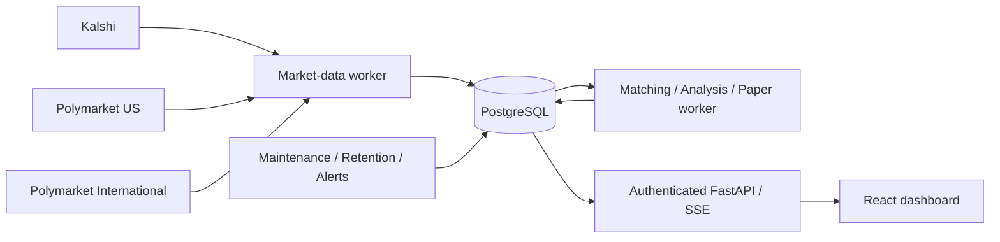

# Arbitrage Intelligence

An auditable sports prediction-market scanner and **paper-execution research
platform** for Kalshi, Polymarket US, and Polymarket International.

**No real-money trading is implemented or enabled.** Live configuration is refused
at startup; execution methods raise explicit errors. Theoretical differences and
paper results are not guaranteed profit, actual earnings, or legal eligibility.

## What it does

- Public discovery through three separate, typed venue adapters with pagination,
  budgets, retry limits and partial-discovery reporting.
- Exact, league-scoped normalization; immutable contract specifications;
  deterministic equivalence gates; operator review with evidence and audit history.
- Kalshi complementary bid/ask transformation; authenticated Kalshi/US streams;
  international public streams; explicit REST fallback when data credentials are
  absent. Gaps, disconnects, lifecycle changes and stale inputs fail closed.
- Decimal depth walking in both complementary directions, dynamic price grids,
  market-specific fees, conservative rounding, fee-inclusive $500-per-venue caps,
  six sizing modes and reproducible inputs.
- Persisted, idempotent, latency-delayed paper intents; partial and one-sided
  fills; conservative liquidity haircut; separate locked and settlement results.
- Seven responsive dark dashboard pages, authenticated operator controls, secure
  sessions, CSRF, rate limiting, revision checks, SSE, alerts and health.
- PostgreSQL/Alembic, durable worker leases, restart recovery, retention, daily
  reports and retained-book replay with version provenance.



## Quick start with Docker

Python is required only to generate the operator hash before container startup.

```powershell
Copy-Item .env.example .env
python -m pip install argon2-cffi
python scripts\generate_admin.py
# Put the printed, single-quoted hash and session secret in .env.
docker compose up --build
```

If this network cannot complete verified TLS to PyPI's download host, set
`$env:ARB_PIP_INDEX_URL='https://mirrors.aliyun.com/pypi/simple/'` before the build.
Official package hashes remain enforced; do not disable TLS verification.

Open **http://localhost:8000**. Default data is explicitly synthetic demo data.
Log in with your chosen password and use **Settings > Enable paper simulation**.
The kill switch starts active; turning it off enables only hypothetical paper
positions. Five per day is a limit/reporting target, not a forced trading quota.

The named PostgreSQL volume survives restarts. `docker compose down` stops this
stack without deleting its data. Never use `down -v` on data you need.

## Native Windows development

```powershell
.\scripts\bootstrap.ps1
$env:DATABASE_URL='sqlite+aiosqlite:///C:\git\arbitrage-engine\backend\arb.db'
$env:FRONTEND_DIST='C:\git\arbitrage-engine\frontend\dist'
Push-Location frontend
npm run build
Pop-Location
.\.venv\Scripts\python.exe scripts\generate_admin.py
# Set ADMIN_PASSWORD_HASH and SESSION_SECRET in this shell or a local .env.
.\.venv\Scripts\python.exe scripts\demo_server.py
```

`demo_server.py` deliberately migrates then starts all local roles on localhost.
It refuses production/public mode. For normal processes use:

```powershell
Push-Location backend
..\.venv\Scripts\alembic.exe upgrade head
uvicorn app.main:app --host 127.0.0.1 --port 8000
# Separate terminal: python -m app.workers all
Pop-Location
```

SQLite is a local/test fallback, not the production database. For React HMR,
run `npm run dev` from `frontend`; Vite proxies the API and SSE.

## Configuration

See `.env.example`. Important settings:

| Setting | Meaning |
|---|---|
| `DATA_MODE=demo` | Isolated synthetic replay; never mixes with public records |
| `DATA_MODE=public` | Read-only venue discovery and books; use a separate deployment/database |
| `GLOBAL_KILL_SWITCH=true` | Initializes the persisted paper circuit breaker; subsequent state is audited in PostgreSQL |
| `ADMIN_PASSWORD_HASH` | Argon2id hash; no default production password |
| `SESSION_SECRET` | At least 32 characters in production; rotation revokes sessions |
| `ALLOWED_ORIGINS` | Exact frontend origin, HTTPS in production |
| `KALSHI_API_KEY`, `KALSHI_PRIVATE_KEY` | Optional authenticated **market-data** WebSocket credentials |
| `POLYMARKET_US_KEY_ID`, `POLYMARKET_US_SECRET_KEY` | Optional US **market-data** WebSocket credentials |
| `MAX_MONITORED_MARKETS=80` | Per-venue bounded pricing universe; discovery remains paginated |
| `REQUEST_RATE=5` | Shared public request pacing; maximum supported value 10 |

Blank credentials are safe. Public HTTP scanning does not require execution keys.
International access is read-only; no VPN/proxy/geographic-restriction evasion.

## Validation

```powershell
.\.venv\Scripts\ruff.exe check backend scripts
.\.venv\Scripts\ruff.exe format --check backend scripts
.\.venv\Scripts\mypy.exe backend\app
.\.venv\Scripts\pytest.exe backend\tests -q
Push-Location frontend
npm run lint
npm run format:check
npm run typecheck
npm test
npm run build
npx playwright install chromium
# Against a running isolated test demo, with E2E_PASSWORD configured:
npm run test:e2e
Pop-Location
.\.venv\Scripts\python.exe scripts\smoke_test.py --workers
.\.venv\Scripts\python.exe scripts\validate_blueprint.py
.\.venv\Scripts\python.exe scripts\public_probe.py
```

OpenAPI: `/docs`; readiness: `/health/ready`; liveness: `/health/live`.
Production data endpoints require login by default. Deployment smoke authentication
uses `ARB_SMOKE_PASSWORD` from the operator environment, never a command-line flag.

## Render

Import `render.yaml` after explicitly committing/pushing your reviewed changes.
It defines API, three workers, a same-origin frontend proxy and private PostgreSQL.
Automatic deployment waits for checks; previews and live execution are off.
See [deployment instructions](docs/deployment-render.md).

## Honest limitations

- Raw public rules often omit required policies or reliable game start. Such
  markets remain unapproved until an operator documents exact evidence. Identical
  team names, AI confidence and human clicking alone never establish equivalence.
- Fair-price cancellation/postponement can break a fixed combined payout and is
  rejected. This materially limits live match counts, deliberately.
- International streams have no documented sequence continuity counter; reconnect
  and periodic authoritative snapshots limit, but cannot prove, lossless delivery.
- REST fallback is not low-latency streaming. Bounded pricing coverage is shown in
  health. API readiness is not venue freshness.
- Optimistic paper is labeled; conservative is default. Observed queue inference
  is explicitly unavailable without required trade/queue evidence, not fake fills.
- Paper bankroll is held until both verified settlements; partial exposure is
  never counted as locked profit. Emergency live hedging is not implemented.
- External email/webhook delivery, subscription billing, commercial redistribution
  rights, LLM providers and live account/execution integrations are not enabled.
  In-app operational alerts and deterministic no-AI matching work independently.

## Documentation

[Plan](docs/implementation-plan.md) · [Architecture](docs/architecture.md) ·
[API research](docs/API_RESEARCH.md) · [Matching](docs/market-matching.md) ·
[Math](docs/arbitrage-math.md) · [Paper](docs/paper-trading.md) ·
[Live safety](docs/live-trading-safety.md) · [Render](docs/deployment-render.md) ·
[Runbook](docs/operations-runbook.md) · [Incidents](docs/incident-response.md) ·
[Assumptions](docs/assumptions.md) · [Security](SECURITY.md).

For observed validation results, deployment status and remaining owner actions,
see [the implementation report](docs/implementation-report.md).
