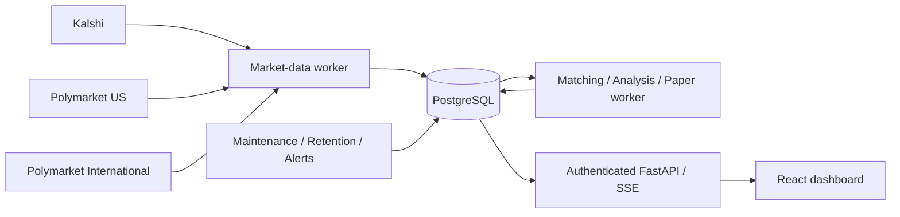

# Arbitrage Intelligence

An auditable sports and opt-in Bitcoin prediction-market scanner and **paper-execution research
platform** for Kalshi, Polymarket US, and Polymarket International.

**No real-money trading is implemented or enabled.** Live configuration is refused
at startup; execution methods raise explicit errors. Theoretical differences and
paper results are not guaranteed profit, actual earnings, or legal eligibility.

## What it does

- Public discovery through three separate, typed venue adapters with pagination,
  budgets, retry limits and partial-discovery reporting.
- Exact, league-scoped normalization; immutable contract specifications;
  deterministic equivalence gates; operator review with evidence and audit history.
- Kalshi complementary bid/ask transformation; authenticated Kalshi/US streams;
  international public streams; explicit REST fallback when data credentials are
  absent. Gaps, disconnects, lifecycle changes and stale inputs fail closed.
- Decimal depth walking in both complementary directions, dynamic price grids,
  market-specific fees, conservative rounding, fee-inclusive $500-per-venue caps,
  six sizing modes and reproducible inputs.
- Profit-maximizing size selection under existing caps and thresholds, with an
  audited size comparison and current-price fee/cost hurdle. Explicit max-depth
  and target-profit modes retain their volume/target objectives.
- Persisted, idempotent, latency-delayed paper intents; partial and one-sided
  fills; conservative liquidity haircut; separate locked and settlement results.
- Eight responsive dark dashboard pages, authenticated operator controls, secure
  sessions, CSRF, rate limiting, revision checks, SSE, alerts and health.
- PostgreSQL/Alembic, durable worker leases, restart recovery, retention, daily
  reports and retained-book replay with version provenance.
- Opportunity validation: every pair's two-direction blockers, independent
  settlement review, exact account-read versus order-permission status,
  additional-cost evidence, distinct episodes and delayed shadow failure trials.
- Bitcoin 15-minute Kalshi/Polymarket US discovery, exact measurement-window
  and opening-reference matching, explicit benchmark/exception evidence,
  expiry-aware paper fills and bounded public diagnostics. Public BTC contracts
  remain unapproved until the settlement and account/cost gates are satisfied.



## Quick start with Docker

Python is required only to generate the operator hash before container startup.

```powershell
Copy-Item .env.example .env
python -m pip install argon2-cffi
python scripts\generate_admin.py
# Put the printed, single-quoted hash and session secret in .env.
docker compose up --build
```

If this network cannot complete verified TLS to PyPI's download host, set
`$env:ARB_PIP_INDEX_URL='https://mirrors.aliyun.com/pypi/simple/'` before the build.
Official package hashes remain enforced; do not disable TLS verification.

Open **http://localhost:8000**. Default data is explicitly synthetic demo data.
Log in with your chosen password and use **Settings > Enable paper simulation**.
The kill switch starts active; turning it off enables only hypothetical paper
positions. Five per day is a limit/reporting target, not a forced trading quota.

The named PostgreSQL volume survives restarts. `docker compose down` stops this
stack without deleting its data. Never use `down -v` on data you need.

## Native Windows development

```powershell
.\scripts\bootstrap.ps1
$env:DATABASE_URL='sqlite+aiosqlite:///C:\git\arbitrage-engine\backend\arb.db'
$env:FRONTEND_DIST='C:\git\arbitrage-engine\frontend\dist'
Push-Location frontend
npm run build
Pop-Location
.\.venv\Scripts\python.exe scripts\generate_admin.py
# Set ADMIN_PASSWORD_HASH and SESSION_SECRET in this shell or a local .env.
.\.venv\Scripts\python.exe scripts\demo_server.py
```

`demo_server.py` deliberately migrates then starts all local roles on localhost.
It refuses production/public mode. For normal processes use:

```powershell
Push-Location backend
..\.venv\Scripts\alembic.exe upgrade head
uvicorn app.main:app --host 127.0.0.1 --port 8000
# Separate terminal: python -m app.workers all
Pop-Location
```

SQLite is a local/test fallback, not the production database. For React HMR,
run `npm run dev` from `frontend`; Vite proxies the API and SSE.

## Configuration

See `.env.example`. Important settings:

| Setting | Meaning |
|---|---|
| `DATA_MODE=demo` | Isolated synthetic replay; never mixes with public records |
| `DATA_MODE=public` | Read-only venue discovery and books; use a separate deployment/database |
| `GLOBAL_KILL_SWITCH=true` | Initializes the persisted paper circuit breaker; subsequent state is audited in PostgreSQL |
| `ADMIN_PASSWORD_HASH` | Argon2id hash; no default production password |
| `SESSION_SECRET` | At least 32 characters in production; rotation revokes sessions |
| `ALLOWED_ORIGINS` | Exact frontend origin, HTTPS in production |
| `KALSHI_API_KEY`, `KALSHI_PRIVATE_KEY` | Optional authenticated **market-data** credentials; RSA-PSS or Ed25519 signing, PEM or base64 PKCS#8 DER |
| `POLYMARKET_US_KEY_ID`, `POLYMARKET_US_SECRET_KEY` | Optional US **market-data** WebSocket credentials |
| `MAX_MONITORED_MARKETS=80` | Per-venue bounded pricing universe; discovery remains paginated |
| `REQUEST_RATE=5` | Shared public request pacing; maximum supported value 10 |
| `OPERATOR_COUNTRY=US`, `OPERATOR_REGION=GA` | Operator jurisdiction, never inferred from the worker's cloud IP |
| `VALIDATION_INTERVAL_SECONDS=10` | Independent all-gate candidate diagnostics |
| `BTC_15M_ENABLED=false` | Opt-in Kalshi/Polymarket US BTC discovery; does not enable live execution |
| `BTC_DISCOVERY_INTERVAL_SECONDS=15` | BTC-only refresh cadence; minimum two seconds |

Blank credentials are safe. Public HTTP scanning does not require execution keys.
International access is read-only; no VPN/proxy/geographic-restriction evasion.
The market-data worker also performs signed **GET-only** Kalshi and Polymarket US
buying-power checks. A successful check does not establish KYC, order permission
or market-specific eligibility. International Polymarket is US close-only.

## Bitcoin 15-minute research

Enable `BTC_15M_ENABLED=true` only in the intended public research environment.
Add `BTC` to the persisted Settings supported universe; an environment flag does
not silently overwrite an existing risk configuration. Keep trading disabled.
The worker refreshes this short-lived universe separately, prioritizes current
BTC books and retires expired matches without erasing diagnostic history.
Kalshi reconstruction preserves every sequenced delta while coalescing published
depth on a 100-ms cadence. Original receipt/provider timestamps are retained;
quiet final updates are flushed and lifecycle invalidation remains immediate.

Match the actual measurement endpoints and immutable opening reference, not the
ticker, slug, trading-open time or a later metadata end date. Both entry
directions walk executable asks and charge the applicable fees. Unknown sampling,
rounding, revision, missing-data or discretionary payouts prevent approval;
an operator cannot waive known published exceptions.

`entry_quantity_step` in Settings defaults to **one contract**, separate from
the venues' actual fractional fill/unwind increments. Use an explicit smaller
increment for fractional entries. Non-nested grids fail closed; more than 10,000
candidate quantities per direction produces `SIZING_GRID_TOO_LARGE`, not an
undisclosed coarser size or a fabricated liquidity error. Reduce the requested
maximum quantity or select a supported entry increment instead.

This bounded public probe does not load `.env`, use credentials, query accounts
or place orders:

```powershell
$env:PYTHONPATH=(Resolve-Path backend).Path
.\.venv\Scripts\python.exe scripts\btc_probe.py --samples 3 --interval 5 --max-contracts 100
```

Conditional price calculations and synthetic profitable tests are not an
approved hedge, observed fills or realized profit. See section 28 of
`docs\implementation-report.md` for the investigation and observed limitations.

## Opportunity-validation pilot

Keep the global paper kill switch active and open **Opportunity validation**.
Screen rule families first, then review the focused 5-10 pairs, exact contract
evidence and scenario payout bounds. The old shortlist is retained, not erased.
If no promising family is found, the sample is explicitly diagnostic-only.
Public-source shadow candidates require independent, hash-bound human review;
clicking approval cannot override missing or incompatible rules. Record verified
funding, conversion, withdrawal, settlement, rebalancing and network costs
separately from venue trading fees, and document eligibility
without pasting credentials. Do not lower profitability or freshness thresholds.

The independent shadow engine uses virtual balances, $25-per-leg default caps,
delayed fresh books and lot-valid partial fills. Injected second-leg failures
and delayed bid-side unwinds are labeled stress, not observed exchange events.
Held hedge/residual capital remains reserved until final settlement. The
dashboard separates unsettled, observed-settlement and failed-hedge results;
operating costs remain unverified until evidenced. Seven to fourteen days is an
initial diagnostic window, not automatic permission to trade; zero qualified
episodes is informative only over well-observed, eligible, approved pairs.
The dashboard preserves the original clock and separately records usable
pair-seconds, funded-size spread windows and unobserved historical coverage.
Unknown or blocked coverage is inconclusive, not evidence of no arbitrage.
Kalshi's signed GET API-key scope check is separate from balance reads and
account/KYC permission; Polymarket US retail permission still needs independent
evidence. No order or preview is submitted.

Ordinary sizing modes maximize qualifying net dollar profit rather than
automatically taking the largest affordable size. Equal-profit sizes prefer less
capital. When no size qualifies, the least-negative/best modeled result remains
diagnostic only, alongside the largest evaluated size's result; it is never a
recommendation to buy a losing position. Candidate details show the gross profit
needed to cover modeled fees, buffers, additional costs and existing net-profit
and return thresholds. This is a hurdle at observed prices, not a fabricated
cheaper quote; changed quotes require recalculating fees. Missing cost,
settlement and account evidence still prevent qualification.

## Validation

```powershell
.\.venv\Scripts\ruff.exe check backend scripts
.\.venv\Scripts\ruff.exe format --check backend scripts
.\.venv\Scripts\mypy.exe backend\app
.\.venv\Scripts\pytest.exe backend\tests -q
Push-Location frontend
npm run lint
npm run format:check
npm run typecheck
npm test
npm run build
npx playwright install chromium
# Against a running isolated test demo, with E2E_PASSWORD configured:
npm run test:e2e
Pop-Location
.\.venv\Scripts\python.exe scripts\smoke_test.py --workers
.\.venv\Scripts\python.exe scripts\validate_blueprint.py
.\.venv\Scripts\python.exe scripts\public_probe.py
```

OpenAPI: `/docs`; readiness: `/health/ready`; liveness: `/health/live`.
Production data endpoints require login by default. Deployment smoke authentication
uses `ARB_SMOKE_PASSWORD` from the operator environment, never a command-line flag.

## Render

Import `render.yaml` after explicitly committing/pushing your reviewed changes.
It defines API, three workers, a same-origin frontend proxy and private PostgreSQL.
Automatic deployment waits for checks; previews and live execution are off.
See [deployment instructions](docs/deployment-render.md).

## US-500 perpetual research

Kalshi's `KXUS500PERP` is a **linear perpetual future on the MerQube US Large Cap
price-return index**, not a complementary $1 binary contract. It is excluded
from binary pricing and the continuous workers. The separate diagnostic is
read-only and does not enable margin trading, submit orders or change accounts:

```powershell
$env:PYTHONPATH = "$PWD\backend"
.\.venv\Scripts\python.exe scripts\us500_probe.py --samples 3 --quantity 1000 --output "$env:TEMP\us500-research.json"
# Optional: read existing Kalshi credentials only for GET enabled/fee evidence.
.\.venv\Scripts\python.exe scripts\us500_probe.py --account-evidence --output "$env:TEMP\us500-account-research.json"
```

Quantity is **API contracts**, not full index-point contracts. Current contract
size, tick size and fractional-trading permission come from the perps API, not
the filing's proposed defaults. The probe walks direct bids/asks, preserves
request/receipt timestamps and marks the missing REST provider timestamp.
Applied historical funding is gross evidence, not future profit or an
annualized yield. Unknown fees and hedge/financing costs keep net profit null.

Funding carry may earn income with an executable, properly financed hedge;
SPY/ES are not proven replicas of this index. Funding reversals, exit basis,
dividends, borrowing and venue-local liquidation can defeat the trade. Synthetic
stress cases are separately labeled and never qualify as live arbitrage.
The October 8 account check returned **margin enabled = false**. No account
setting was changed. See report section 30 for primary sources and live results.

## Honest limitations

- Raw public rules often omit required policies or reliable game start. Such
  markets remain unapproved until an operator documents exact evidence. Identical
  team names, AI confidence and human clicking alone never establish equivalence.
- Fair-price cancellation/postponement can break a fixed combined payout and is
  rejected. This materially limits live match counts, deliberately.
- International streams have no documented sequence continuity counter; reconnect
  and periodic authoritative snapshots limit, but cannot prove, lossless delivery.
- REST fallback is not low-latency streaming. Bounded pricing coverage is shown in
  health. API readiness is not venue freshness.
- Optimistic paper is labeled; conservative is default. Observed queue inference
  is explicitly unavailable without required trade/queue evidence, not fake fills.
- Paper bankroll is held until both verified settlements; partial exposure is
  never counted as locked profit. Emergency live hedging is not implemented.
- External email/webhook delivery, subscription billing, commercial redistribution
  rights, LLM providers and live account/execution integrations are not enabled.
  In-app operational alerts and deterministic no-AI matching work independently.

## Documentation

[Plan](docs/implementation-plan.md) · [Architecture](docs/architecture.md) ·
[API research](docs/API_RESEARCH.md) · [Matching](docs/market-matching.md) ·
[Math](docs/arbitrage-math.md) · [Paper](docs/paper-trading.md) ·
[Live safety](docs/live-trading-safety.md) · [Render](docs/deployment-render.md) ·
[Runbook](docs/operations-runbook.md) · [Incidents](docs/incident-response.md) ·
[Assumptions](docs/assumptions.md) · [Security](SECURITY.md).

For observed validation results, deployment status and remaining owner actions,
see [the implementation report](docs/implementation-report.md).
